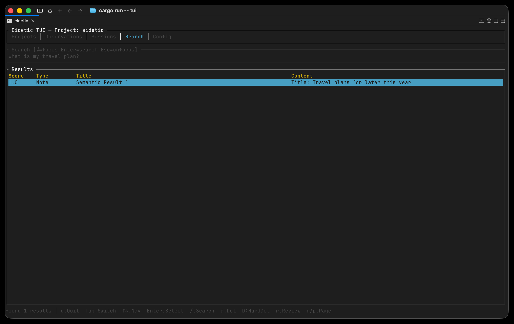

# Eidetic

**Eidetic** is an Agent-Agnostic Memory MCP Server. It provides a structured, long-term memory system via the Model Context Protocol (MCP).

Eidetic enables **memory portability**: a memory created by one agent (e.g. Claude Code) can be instantly recalled by another (e.g. Cursor). 

Agents can automatically store, recall, deduplicate, and review project knowledge—such as architectural decisions, user preferences, and bug resolutions—so they never have to start from scratch.

---



## Index

- [Installation](#installation)
- [Agent Integration](#agent-integration)
- [Features](#features)
- [Storage Backends](#storage-backends)
  - [Memwal](#memwal)
  - [SQLite](#sqlite)
  - [File](#file)
- [MCP Tools](#mcp-tools)
- [Harbor Backups & Artifacts](#harbor-backups--artifacts)
- [TUI Storage Inspector](#tui-storage-inspector)
- [License](#license)

---

## Installation

You can install Eidetic in two ways:

### 1. Via NPM (Recommended)
You can install the pre-compiled binary wrapper globally using npm:

```bash
npm install -g eidetic-mcp
```

Or run it directly using `npx`:
```bash
npx eidetic-mcp
```

### 2. Via Cargo (From Source)
If you prefer to build from source, you can use Cargo:

```bash
git clone https://github.com/mcxross/eidetic.git
cd eidetic
cargo install --path .
```


### Account Setup: Memwal & Harbor

**Memwal Setup**
To fully automate the creation, registration, and funding of a Memwal backend account on the Sui network, use:
```bash
eidetic setup memwal
```
This interactive command guides you through generating an identity

**Harbor Setup**
To enable secure database backups and artifact storage, configure Harbor:
```bash
eidetic setup harbor
```
You will be prompted for your Harbor API Key and Service Private Key. These are stored securely in your system's native keychain.

---

## Agent Integration

Eidetic features a built-in auto-setup command to easily inject itself into the configuration files of popular coding agents.

Run the following command to register Eidetic with your agent of choice:

```bash
eidetic setup <agent>
```

### Supported Agents
*   `claude` - Claude Code CLI
*   `claude-desktop` - Claude Desktop App
*   `cursor` (or `pi`) - Cursor IDE
*   `vscode` - Visual Studio Code
*   `opencode` - OpenCode
*   `gemini-cli` - Gemini CLI
*   `codex` - OpenAI Codex CLI

**Example**:
```bash
eidetic setup cursor
```
This will automatically parse your `~/.cursor/mcp.json` file, safely merge Eidetic as an available MCP server, and point the agent to the exact Eidetic executable path.

## Features

### MCP Server
Start the MCP server manually (usually handled automatically by your agent):
```bash
eidetic serve
```
By default, the server uses Memwal to store semantic memories.

### Configuration
Eidetic persists its configuration in `~/.eidetic/config.json`. This includes your storage backend preferences, custom paths, and Memwal configurations.

You can view the active configuration and backend details via:
```bash
eidetic info
```

---

## Storage Backends

Eidetic supports multiple storage layers through `--storage-backend` or the `EIDETIC_STORAGE_BACKEND` environment variable.

Available backends:

| `memwal` | Default semantic memory network |
| `sqlite` | Local relational database |
| `file` | Simple JSON file storage |

Use `--storage-path` or `EIDETIC_STORAGE_PATH` to choose the local storage/index directory.

### Memwal (Default)

Memwal is the default decentralized semantic memory network for Eidetic.

Start the MCP server with Memwal (default behavior):

```bash
eidetic serve
```

Or configure it with environment variables:

```bash
export EIDETIC_STORAGE_BACKEND=memwal
export EIDETIC_MEMWAL_REGISTRY_ID=0x...
eidetic serve
```

Memwal account selection is handled by Eidetic's authentication layer:

1. On startup, Eidetic reads `~/.sui/sui_config/client.yaml`, `sui.aliases`, and the configured `sui.keystore`.
2. It derives available Ed25519 Sui accounts locally from private key material.
3. It defaults to `client.yaml.active_address` when that account has usable key material.
4. The memory storage layer receives only the active Memwal client/configuration; it does not manage private keys directly.

Memwal configuration options:

| CLI flag | Environment variable | Description |
| --- | --- | --- |
| `--memwal-account-id` | `EIDETIC_MEMWAL_ACCOUNT_ID` | Existing Memwal account object ID to reuse |
| `--memwal-registry-id` | `EIDETIC_MEMWAL_REGISTRY_ID` | Memwal registry object ID for account reuse/creation |
| `--memwal-server-url` | `EIDETIC_MEMWAL_SERVER_URL` | Memwal relayer/server URL |
| `--memwal-relayer-config-url` | `EIDETIC_MEMWAL_RELAYER_CONFIG_URL` | Explicit relayer config URL |
| `--memwal-namespace` | `EIDETIC_MEMWAL_NAMESPACE` | Memory namespace, defaults to `eidetic` |
| `--memwal-delegate-label` | `EIDETIC_MEMWAL_DELEGATE_LABEL` | Delegate key label, defaults to `eidetic-mcp` |
| `--sui-config-dir` | `EIDETIC_SUI_CONFIG_DIR` | Override Sui config directory, defaults to `~/.sui/sui_config` |

Memwal MCP utility tools:

| Tool | Purpose |
| --- | --- |
| `mem_sui_accounts` | Lists usable Sui accounts discovered from `~/.sui` without exposing private keys |
| `mem_select_sui_account` | Selects the account used by Memwal operations for the current server process |
| `mem_memwal_config` | Shows redacted active Memwal configuration and backend status |

Example account flow:

```text
mem_sui_accounts
mem_select_sui_account { "selector": "my-sui-alias-or-0x-address" }
mem_memwal_config
```

Account selection is process-local. Eidetic does not persist the selected Memwal account across server restarts. If no account is selected after restart, Eidetic reloads `~/.sui` and falls back to Sui's `active_address`.

### Other Storage Options

If you prefer to store data strictly locally, Eidetic offers alternative backends.

#### SQLite

SQLite requires no external services:

```bash
eidetic --storage-backend sqlite serve
```

Choose a custom database directory:

```bash
eidetic --storage-backend sqlite --storage-path ~/.local/share/eidetic-mcp/storage serve
```

#### File

The file backend stores JSON documents directly on disk:

```bash
eidetic --storage-backend file serve
```

Choose a custom file storage directory:

```bash
eidetic --storage-backend file --storage-path ~/.local/share/eidetic-mcp/files serve
```

Use this backend when you want easy inspection or simple portable JSON files. SQLite is generally a better default for normal use.

---

## MCP Tools

Eidetic exposes the following MCP tools to connected agents.

### Core Memory

| Tool | Purpose |
| --- | --- |
| `mem_save` | Save a structured observation such as a decision, bugfix, pattern, discovery, task, note, or learning |
| `mem_update` | Update an existing observation by ID |
| `mem_delete` | Delete an observation; soft delete is the default, hard delete is optional |
| `mem_search` | Full-text search across memories for the current or specified project |
| `mem_get_observation` | Fetch the full content and metadata for a specific memory |
| `mem_suggest_topic_key` | Suggest a stable `topic_key` before saving evolving topic-based memories |
| `mem_save_prompt` | Save a user prompt for future context |

### Sessions

| Tool | Purpose |
| --- | --- |
| `mem_session_start` | Register the start of a work session |
| `mem_session_end` | Mark a session as completed |
| `mem_context` | Retrieve recent context from previous sessions and observations |
| `mem_session_summary` | Save an end-of-session summary |

### Projects

| Tool | Purpose |
| --- | --- |
| `mem_current_project` | Detect the current project from a working directory; recommended as a first call |
| `mem_merge_projects` | Merge project name variants into a canonical project |

### Advanced Review and Relations

| Tool | Purpose |
| --- | --- |
| `mem_timeline` | Get chronological context around a specific observation |
| `mem_capture_passive` | Extract learnings from text output and save them as memories |
| `mem_review` | List observations whose review lifecycle is stale; can mark items reviewed |
| `mem_judge` | Record a verdict for a pending memory conflict surfaced by `mem_save` |
| `mem_compare` | Persist a semantic relation verdict between two existing observations |

### Diagnostics and Configuration

| Tool | Purpose |
| --- | --- |
| `mem_stats` | Return memory system statistics for a project |
| `mem_doctor` | Run read-only diagnostics for project detection and storage health |
| `eidetic_status` | Return server health, current config, and actionable Memwal gas errors |

### Artifact Management
| Tool | Purpose |
| --- | --- |
| `mem_save_artifact` | Upload raw bytes (code, images, etc.) to Harbor and save a reference locally or semantically |
| `mem_get_artifact` | Download and decode an artifact from Harbor using its File ID |

### Memwal Account Tools

These tools are available when the server is running with `--storage-backend memwal`.

| Tool | Purpose |
| --- | --- |
| `mem_sui_accounts` | List usable Sui accounts discovered from `~/.sui` without exposing private keys |
| `mem_select_sui_account` | Select the Sui account used by Memwal operations for the current server process |
| `mem_memwal_config` | Show redacted active Memwal account and backend configuration |

---

## Harbor Backups & Artifacts

Eidetic natively integrates with [Harbor](https://harbor.com) for secure object storage. Once configured (`eidetic setup harbor`), you can safely backup your local database or store model-generated artifacts.

### Database Backups
Snapshot and upload your local database to Harbor:
```bash
eidetic backup
```
Restore a specific backup:
```bash
eidetic restore monday
```

### Artifacts
When an agent creates an artifact (like code or images), it is sent directly to Harbor. A semantic reference is then saved to your active memory backend. Agents can seamlessly recall and download these artifacts using their natural context.

### TUI Storage Inspector
Eidetic comes with a built-in Terminal UI to easily inspect, search, review, and delete the memories stored by your agents.

```bash
eidetic tui
```
**Controls:**
*   `Tab` - Switch views (Projects, Observations, Sessions, Search)
*   `Enter` - View details for an observation
*   `d` - Soft-delete an observation
*   `D` - Hard-delete an observation
*   `r` - Mark an observation as reviewed
*   `/` - Open search

## Debugging and Inspector

If you want to manually inspect and debug the Eidetic MCP server, you can use the official MCP Inspector.

To run the inspector using `npx`:
```bash
npx @modelcontextprotocol/inspector eidetic serve
```
If you are developing locally from source, you can also run:
```bash
npx @modelcontextprotocol/inspector cargo run -- serve
```

For more details on inspecting and debugging, please refer to the official MCP documentation:
- [MCP Inspector](https://modelcontextprotocol.io/docs/tools/inspector)
- [MCP Debugging](https://modelcontextprotocol.io/docs/tools/debugging)

---

## License
Apache 2.0
